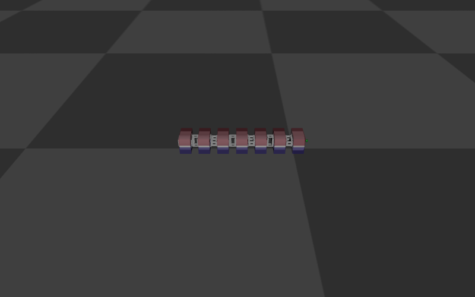
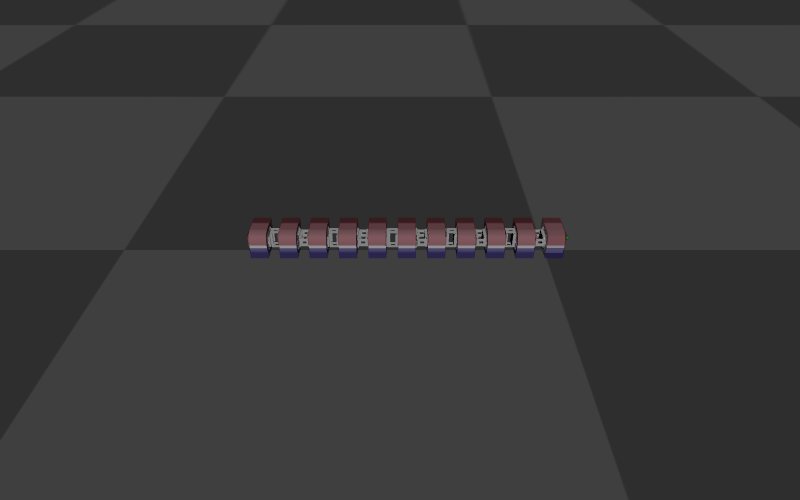
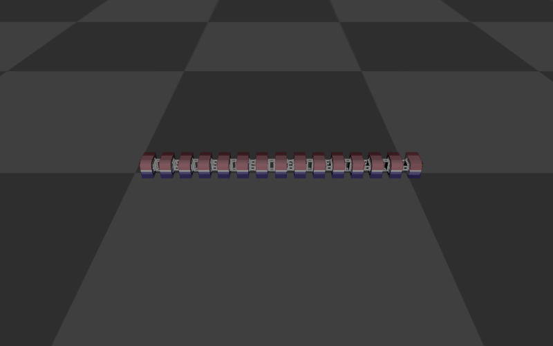
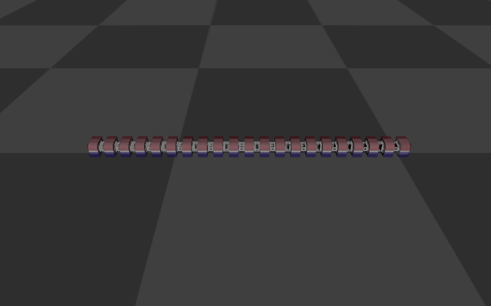

# resources_rebuttal — CoRL 2026 리부탈용 관절 수 스케일링 모델

CoRL 2026 Submission #676 리부탈의 **관절 수 스케일링 실험**(리뷰어 Hhic Q5:
"GD 유무에 따른 수렴 속도를 관절 수 n의 함수로 보여달라")을 위한 n-DOF 뱀 로봇
MJCF 모델 모음이다.

**원본 학습 환경(`../resources/`)과 완전히 분리되어 있다.** 이 디렉토리의
어떤 파일도 기존 환경·진행 중인 학습에 영향을 주지 않으며, 원본 파일은 읽기
전용 소스로만 사용된다. 메시 에셋(`../resources/assets/`)은 복사하지 않고
상대경로로 공유한다.

## 파일 구성

| 파일 | 설명 |
|------|------|
| `generate_scalable_mjcf.py` | MJCF 생성기. `../resources/horcrux_p.xml`을 파싱해 head / h-link / v-link 바디를 템플릿으로 추출한 뒤 관절 수 n짜리 체인으로 재조립 |
| `horcrux_n{06,10,14,20}.xml` | 생성된 본체 모델 (n개 힌지 관절, **자동 생성 — 직접 수정 금지**) |
| `horcrux_plane_n{06,10,14,20}.xml` | 생성된 평지 월드 (본체 include + floor, `../resources/horcrux_plane.xml`과 동일 조건) |
| `previews/horcrux_n{NN}.png` | 각 모델의 MuJoCo 렌더링 미리보기 (`--render-previews`로 재생성) |

## 모델 미리보기

| n=6 | n=10 |
|:---:|:----:|
|  |  |

| n=14 (원본과 등가) | n=20 |
|:---:|:----:|
|  |  |

## 모델 구조 (원본과 동일한 규칙)

- head(link1, freejoint) + link2..link{n+1}, 힌지 관절 n개
- 관절 축 교대: joint1=Y(수직), joint2=Z(수평), … / 링크 간격 0.0685 m
- 관절: ±45°, damping 0.13, armature 0.01 / 모터: 토크 ±3 N·m, gear 1
- 센서 순서: jointpos ×n → jointvel ×n → actuatorfrc ×n → touch top ×n →
  touch bot ×n → head IMU(framequat 4 + gyro 3 + accelerometer 3)
  - 총 sensordata 크기 = **5n + 10** (touch는 원본과 동일하게 마지막 링크 제외)
- 링크당 질량 0.165 kg (collision mesh geom), timestep 0.005 s,
  floor friction 0.65

## 재생성 및 검증

```bash
conda run -n horcrux python generate_scalable_mjcf.py            # n=6,10,14,20
conda run -n horcrux python generate_scalable_mjcf.py --n 8 16   # 임의 n
MUJOCO_GL=egl conda run -n horcrux python generate_scalable_mjcf.py --render-previews  # + 미리보기 PNG
```

생성 시 자동으로 수행되는 검증:

1. **차원 검사** — 각 n에 대해 nq=7+n, nu=n, nsensordata=5n+10 확인
2. **n=14 등가성 검증** — 재생성한 n=14 모델을 원본
   `horcrux_plane.xml`과 비교: 모든 물리 파라미터(질량, 관절 범위, damping,
   armature, ctrlrange, 마찰, timestep) 일치 + 동일 토크 시퀀스 2000스텝
   롤아웃에서 **max |qpos diff| = 0.0** (비트 단위 동일)

이 등가성 검증이 "n만 바꾼 동일 플랫폼"이라는 리부탈 주장의 근거다.

## 이력

- 2026-08-05: 최초 생성 (Claude Code 세션, 상세는 `CLAUDE_CHANGES.md` 참조)
